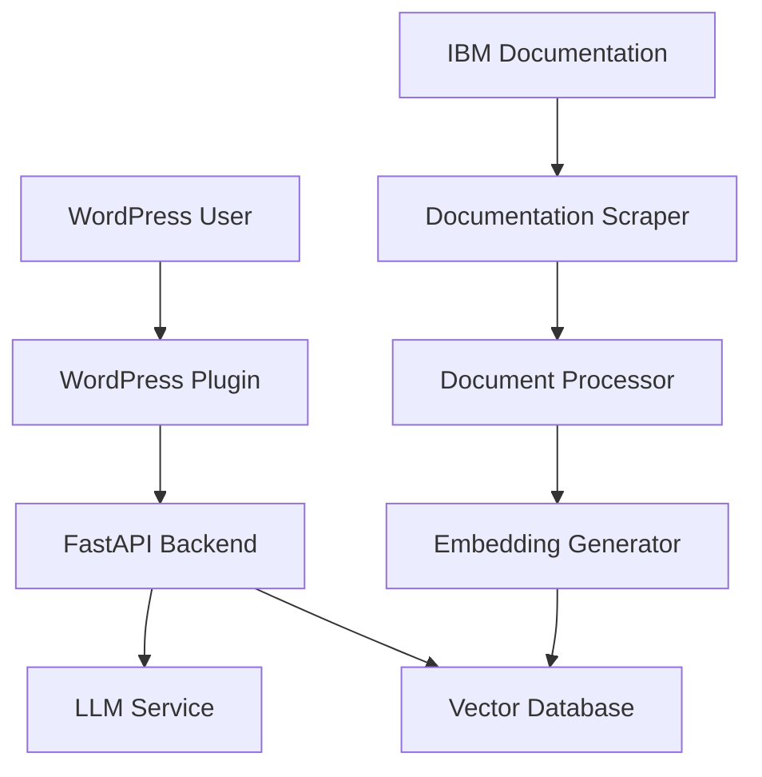
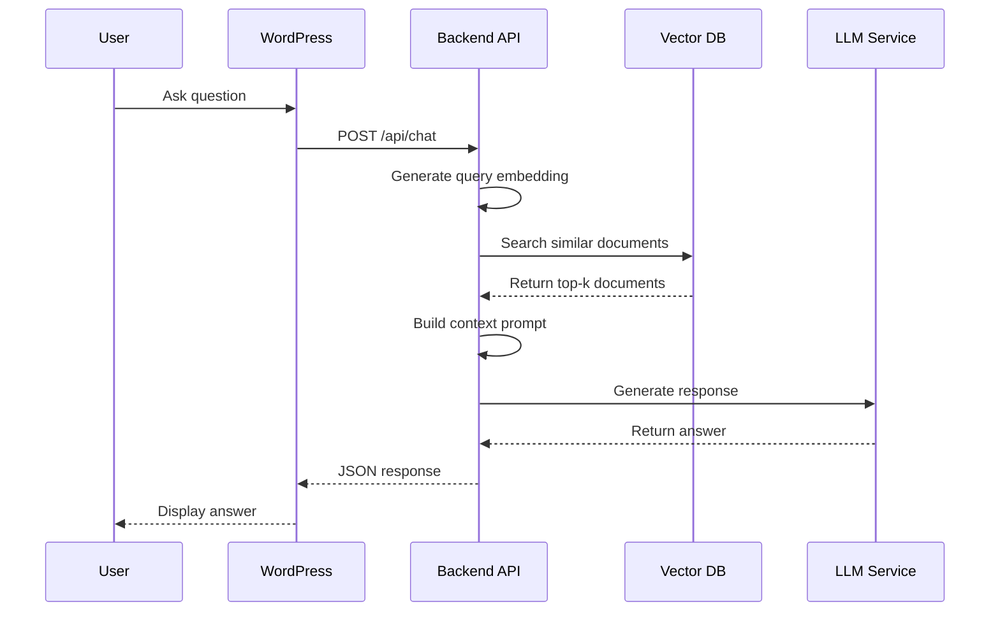

# IBM Documentation LLM System - Architecture Design

## Executive Summary

This document outlines the architecture for an LLM-powered question-answering system that integrates with WordPress and uses IBM documentation as its knowledge base. The system uses Retrieval Augmented Generation (RAG) to provide accurate, context-aware responses.

## System Overview



## Architecture Components

### 1. Documentation Ingestion Pipeline

**Purpose**: Scrape, process, and index IBM documentation

**Components**:
- **Web Scraper**: Python-based scraper using BeautifulSoup/Scrapy
- **Document Processor**: Chunks documents into semantic units
- **Embedding Generator**: Creates vector embeddings using sentence-transformers
- **Vector Database**: Stores embeddings for fast retrieval

**IBM Documentation Sources**:
- IBM Cloud Docs (cloud.ibm.com/docs)
- IBM Watson Documentation
- IBM Product Documentation
- IBM Developer Resources

### 2. LLM Backend Service

**Technology Stack**:
- **Framework**: FastAPI (Python)
- **LLM Provider**: OpenAI API (GPT-4 Turbo) - Recommended for scalability
- **Alternative**: Anthropic Claude or open-source models (Llama 3)
- **Vector DB**: Pinecone (managed) or Qdrant (self-hosted)
- **Embedding Model**: text-embedding-3-small (OpenAI) or all-MiniLM-L6-v2

**Key Features**:
- RESTful API endpoints
- RAG implementation with context retrieval
- Conversation history management
- Rate limiting and authentication
- Caching for common queries

### 3. WordPress Integration

**Plugin Components**:
- **Chat Widget**: Frontend interface for users
- **Admin Panel**: Configuration and monitoring
- **API Client**: Communicates with backend service
- **Settings Page**: API key management, customization

**Features**:
- Embeddable chat widget
- Shortcode support for custom placement
- Conversation history
- Customizable UI themes
- Analytics dashboard

## Detailed Architecture

### RAG Pipeline Flow



### Data Flow

1. **Ingestion Phase**:
   - Scraper fetches IBM documentation pages
   - Content is cleaned and chunked (500-1000 tokens)
   - Metadata extracted (title, URL, section, date)
   - Embeddings generated and stored in vector DB

2. **Query Phase**:
   - User question received via WordPress
   - Question embedded using same model
   - Vector similarity search retrieves relevant chunks
   - Context + question sent to LLM
   - Response generated and returned

3. **Feedback Loop**:
   - User interactions logged
   - Quality metrics tracked
   - System improved based on usage patterns

## Technology Recommendations

### Recommended Stack (Scalable & Cost-Effective)

**Backend**:
- Python 3.11+
- FastAPI for API server
- OpenAI API (GPT-4 Turbo) for LLM
- Pinecone for vector database (free tier: 100k vectors)
- Redis for caching
- PostgreSQL for metadata and conversation history

**WordPress Plugin**:
- PHP 8.0+
- React.js for admin dashboard
- Vanilla JS for chat widget (lightweight)
- WordPress REST API integration

**Deployment**:
- Backend: Railway, Render, or AWS Lambda
- Vector DB: Pinecone (managed)
- WordPress: Existing hosting

### Alternative Stack (Self-Hosted)

**Backend**:
- Llama 3 or Mistral (via Ollama)
- Qdrant (self-hosted vector DB)
- Docker containers

**Pros**: Lower ongoing costs, data privacy
**Cons**: Higher setup complexity, requires GPU for good performance

## API Endpoints

### Backend API

```
POST /api/chat
- Request: { "question": "string", "conversation_id": "string?" }
- Response: { "answer": "string", "sources": [], "conversation_id": "string" }

POST /api/ingest
- Request: { "url": "string", "source_type": "string" }
- Response: { "status": "success", "documents_processed": number }

GET /api/health
- Response: { "status": "healthy", "version": "string" }

GET /api/sources
- Response: { "sources": [{ "title": "string", "url": "string", "last_updated": "date" }] }
```

### WordPress REST API

```
POST /wp-json/ibm-llm/v1/chat
- Proxies to backend API
- Handles authentication

GET /wp-json/ibm-llm/v1/settings
- Returns plugin configuration
```

## Security Considerations

1. **API Authentication**:
   - API key-based authentication
   - Rate limiting per user/IP
   - CORS configuration

2. **Data Privacy**:
   - No PII stored in vector DB
   - Conversation history encrypted
   - GDPR compliance options

3. **WordPress Security**:
   - Nonce verification
   - Capability checks
   - Input sanitization

## Scalability Strategy

### Phase 1: MVP (0-1000 queries/month)
- Single backend instance
- Pinecone free tier
- OpenAI API pay-as-you-go

### Phase 2: Growth (1000-10000 queries/month)
- Load balancer + multiple backend instances
- Redis caching layer
- Pinecone paid tier

### Phase 3: Scale (10000+ queries/month)
- Kubernetes deployment
- CDN for static assets
- Advanced caching strategies
- Consider fine-tuned model

## Cost Estimation

### Monthly Costs (Phase 1)

**OpenAI API**:
- GPT-4 Turbo: $0.01/1k input tokens, $0.03/1k output tokens
- Embeddings: $0.0001/1k tokens
- Estimated: $20-50/month for 1000 queries

**Infrastructure**:
- Backend hosting (Railway/Render): $5-20/month
- Pinecone free tier: $0
- Total: $25-70/month

### Cost Optimization

1. Implement aggressive caching
2. Use GPT-3.5 Turbo for simple queries
3. Batch embedding generation
4. Monitor and optimize token usage

## Performance Targets

- Query response time: < 3 seconds
- Vector search latency: < 200ms
- API availability: 99.5%
- Concurrent users: 50+

## Monitoring & Analytics

**Metrics to Track**:
- Query volume and patterns
- Response quality (user feedback)
- API latency and errors
- Token usage and costs
- Popular topics/questions

**Tools**:
- Application logs (structured JSON)
- Error tracking (Sentry)
- Analytics dashboard in WordPress admin
- OpenAI usage dashboard

## Development Phases

### Phase 1: Foundation (Weeks 1-2)
- Set up development environment
- Implement basic scraper
- Create vector database schema
- Build minimal API

### Phase 2: Core Features (Weeks 3-4)
- Complete RAG pipeline
- Develop WordPress plugin
- Implement chat interface
- Add authentication

### Phase 3: Enhancement (Weeks 5-6)
- Admin dashboard
- Monitoring and logging
- Performance optimization
- Testing and bug fixes

### Phase 4: Deployment (Week 7)
- Production deployment
- Documentation
- User training
- Launch

## Future Enhancements

1. **Multi-language Support**: Translate IBM docs and responses
2. **Voice Interface**: Add speech-to-text capabilities
3. **Advanced Analytics**: ML-powered insights
4. **Custom Training**: Fine-tune model on specific IBM products
5. **Integration**: Connect with IBM Cloud APIs for live data
6. **Mobile App**: Native mobile experience

## Conclusion

This architecture provides a scalable, cost-effective solution that can grow with your needs. The RAG approach ensures accurate responses grounded in IBM documentation, while the WordPress integration makes it accessible to end users.

**Recommended Next Steps**:
1. Review and approve this architecture
2. Set up development environment
3. Begin with documentation scraper
4. Build MVP backend API
5. Develop WordPress plugin
6. Test and iterate